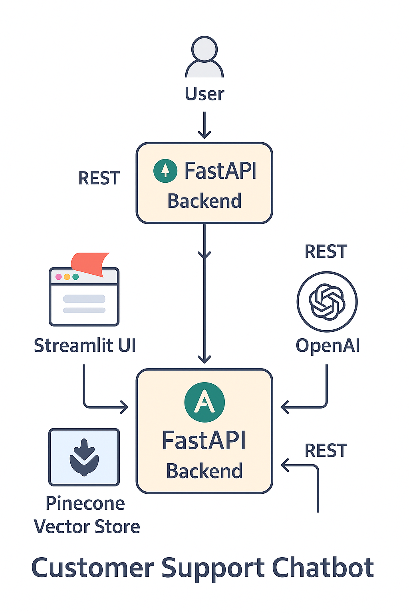

# 💬 Customer support Chatbot

A **Retrieval-Augmented Generation (RAG)** powered chatbot for intelligent customer support, document Q&A, and FAQ generation.  
This project integrates **Streamlit** for the frontend, **FastAPI** for the backend, **Pinecone** as the vector store, and **OpenAI GPT models** for LLM capabilities.

---

## 📌 System Architecture

  

### Components:
- **User Interface (Streamlit)**
  - Chat interface
  - FAQ section
  - Analytics dashboard
- **Backend API (FastAPI)**
  - Exposes endpoints for query, FAQ generation, and ingestion
  - Manages chat sessions and history
- **Enhanced RAG Chain (LangChain)**
  - Context-aware query answering
  - Summarization & FAQ generation
  - Follow-up suggestions
- **Vector Database (Pinecone)**
  - Stores document embeddings
  - Supports similarity search
- **OpenAI GPT (LLM)**
  - Provides reasoning, contextual responses, and natural language generation

---

## 🚀 Features

- 📄 **Document Ingestion** (PDFs, folder indexing)
- 💬 **Chat with documents** using RAG
- 🤖 **AI-Generated FAQs**
- ✨ **Follow-up Suggestions**
- 📊 **Analytics Dashboard**
- 📧 **Notification-ready endpoints**
- 🧠 **Context-aware conversation handling**

---

## 🛠️ Prerequisites

- Python **3.9+**
- [Pinecone API key](https://www.pinecone.io)
- [OpenAI API key](https://platform.openai.com/)
- pip or conda environment manager

---

## ⚙️ Installation

Clone the repository:

\`\`\`bash
git clone <your-repo-link>
cd Chatbot-RAG-Application
\`\`\`

Create and activate a virtual environment:

\`\`\`bash
python -m venv rag_env
# Windows
rag_env\Scripts\activate
# Linux/Mac
source rag_env/bin/activate
\`\`\`

Install dependencies:

\`\`\`bash
pip install -r requirements.txt
\`\`\`

Set environment variables (e.g., in `.env` file):

\`\`\`env
OPENAI_API_KEY=your_openai_api_key
PINECONE_API_KEY=your_pinecone_api_key
PINECONE_ENV=your_pinecone_environment
\`\`\`

---

## ▶️ Running the Application

### 1. Start FastAPI Backend
Runs on **http://127.0.0.1:8000**

\`\`\`bash
uvicorn main:app --reload --host 127.0.0.1 --port 8000
\`\`\`

### 2. Start Streamlit Frontend
Runs on **http://localhost:8501**

\`\`\`bash
streamlit run enhanced_streamlit_app.py --server.enableXsrfProtection=false --server.enableCORS=false
\`\`\`

---

## 📊 Usage

- Open [http://localhost:8501](http://localhost:8501)
- Upload documents (PDFs) via the sidebar
- Ask questions about your documents
- Generate AI-based FAQs
- Explore analytics dashboard

---

## 🐳 Docker Setup (Optional)

Build and run with Docker:

\`\`\`bash
docker build -t chatbot-rag .
docker run -p 8000:8000 -p 8501:8501 chatbot-rag
\`\`\`

---

## 📂 Project Structure

\`\`\`
Chatbot-RAG-Application/
├── main.py                  # FastAPI backend
├── enhanced_streamlit_app.py # Streamlit frontend
├── src/                     # RAG, ingestion, LLM logic
├── requirements.txt         # Dependencies
├── system_architecture.png  # System architecture diagram
└── README.md
\`\`\`

---

## 📌 Roadmap

- [ ] Add support for multiple vector stores
- [ ] Deploy on Kubernetes
- [ ] Add authentication & user roles
- [ ] Integrate notification services

---

## 🤝 Contributing

Minhaj M.H.A. : EG/2020/4076
Morais M.N.S. : EG/2020/4077
Balasooriya B.A.L.M : EG/2020/3838
Sulaiman M.N. : EG/2020/4342

